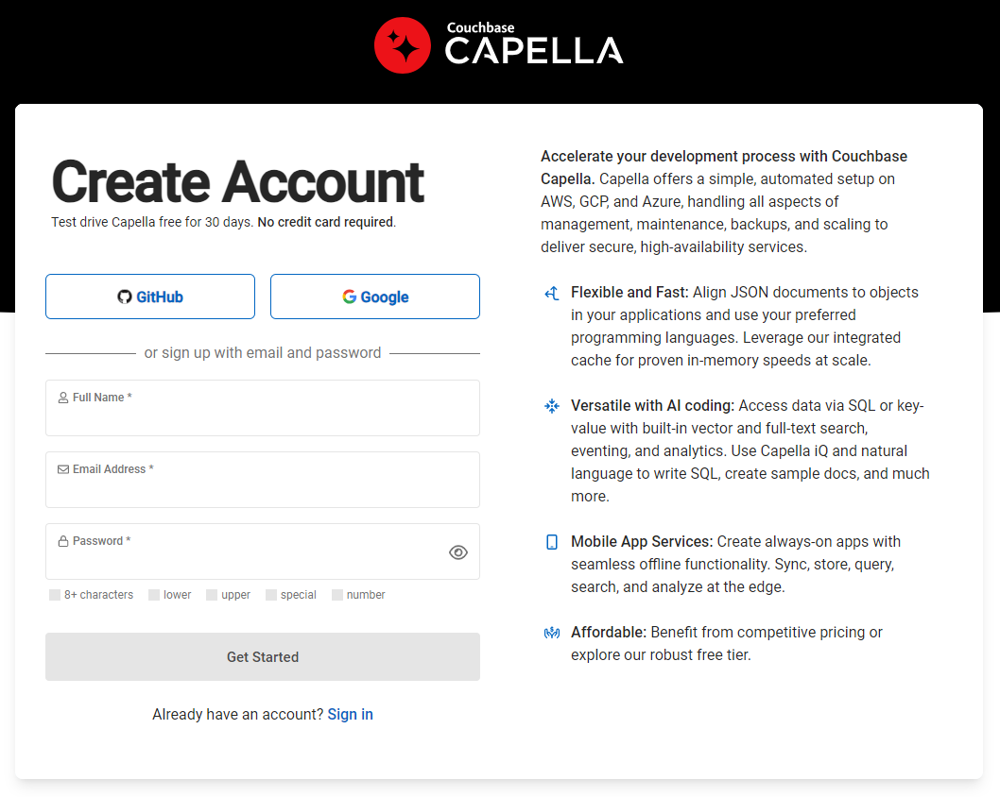
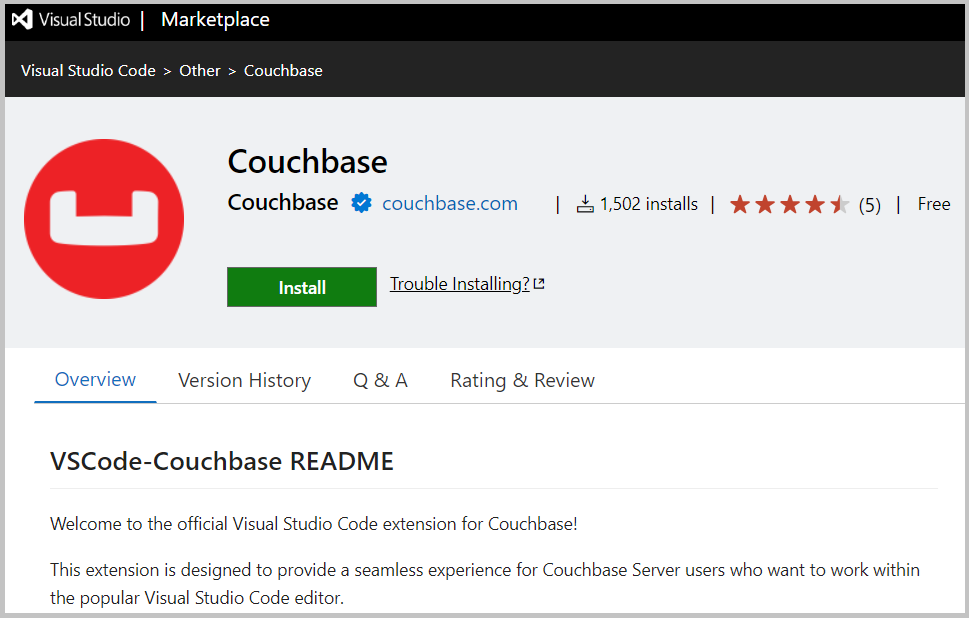

## Create a Free Couchbase Capella Trial Account

* Go to *[https://cloud.couchbase.com/sign-up](https://cloud.couchbase.com/sign-up)*, and create a free 30-days trial account for Couchbase Capella (Operational), with no credit card or other obligation required.  

* After 30 days, your account will be automatically converted for **Free Tier**. Where you can continue to use one limited cluster.

* Use either your Google or GitHub account. Or enter some name, a valid email address (you may be required to confirm) and select a password.  

* Once you access your own Couchbase Capella web UI, click on your trial cluster name, and make sure you have in the *Data Tools* tab the **travel-sample** database installed. If not, go to *Import > Load sample data*, and import it.  

* Go to *Connect > Allowed IP Addresses*, and enter your own IP address, to be able to connect remotely to your cluster.  

* Go to *Connect > Database Access* and create some credentials - a user name and a password - that you will use to connect remotely to your cluster.  

## Install Visual Studio Code with the Couchbase Extension

* Install and configure [*Visual Studio Code (VSCode)*](https://code.visualstudio.com/). This is also 100% free and easy to use.  

* From VSCode's *Extensions* tab, search for and install the [*Couchbase Plugin*](https://www.couchbase.com/blog/couchbase-visual-studio-code/).  

* From your Couchbase extension, connect to your Couchbase Capella cluster, using the *Public Connection String* from the Connect tab (something like *couchbases://cb.ewydjghsojb9kfuj.cloud.couchbase.com*), always check SSL for a secure connection, then use the *Database Access* credentials you created before. You must be able to browse and expand now in the left sidebar your cluster into buckets, scopes, and collections.  

 * Open SQLPP files (Workbench) and SQLPPNB files (Jupyter Notebooks) with SQL++ queries that can be executed using the Couchbase plugin.